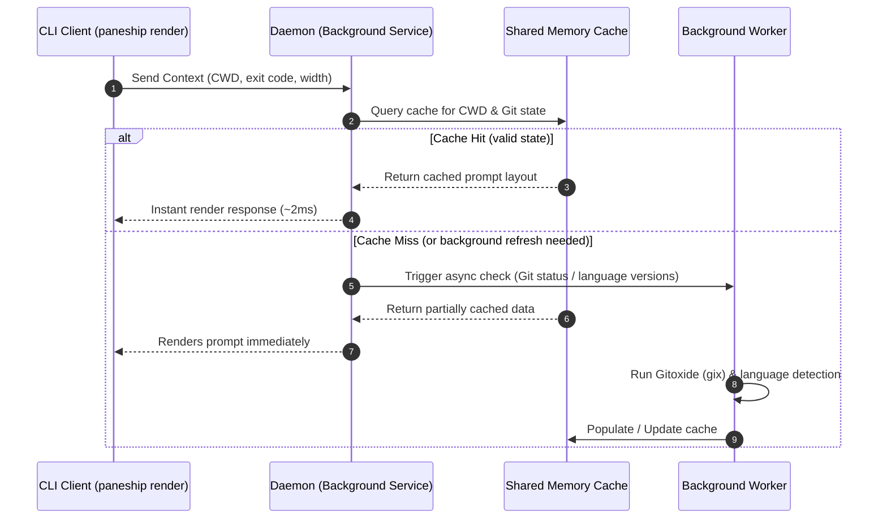

<div align="center">


# Paneship

**A blazingly fast, high-performance shell prompt optimized for tmux and large Git repositories.**

[](https://crates.io/crates/paneship)
[](https://docs.rs/paneship)
[](https://github.com/andev0x/paneship/actions)
[](./LICENSE)
[](https://github.com/andev0x/paneship/stargazers)

---

[Key Features](#-features) • [Demo](#-demo) • [Installation](#-installation) • [Shell Setup](#-shell-setup) • [Configuration](#%EF%B8%8F-configuration) • [Architecture](#-architecture) • [Benchmarks](#-benchmarks) • [CLI Commands](#-cli-commands) • [Troubleshooting](#-troubleshooting) • [Contributing](#-contributing)

</div>

---

## 📖 About

**Paneship** is a modern, ultra-fast, and customizable command-line prompt utility written in Rust. It is engineered from the ground up for developers who work in terminal multiplexers (like tmux), manage large Git repositories, and demand a snappy shell interface. 

By leveraging a persistent background daemon, asynchronous Git checks, and smart cache invalidation, Paneship achieves a rendering speed of **~2.5ms**, keeping your shell highly responsive even in massive monorepos.

---

## ✨ Features

- ⚡ **Sub-millisecond Performance** – Renders in **~2.5ms** on average by using a client-daemon architecture.
- 🔄 **Async Background Workers** – Git status checks and programming language detections run in background threads, so your prompt never blocks.
- 🐚 **Multi-Shell Compatibility** – Native integration scripts for Zsh, Bash, Fish, PowerShell, Nushell, Elvish, Xonsh, Tcsh, Ion, and Cmd.
- 🪟 **Tmux-Aware & Responsive** – Automatically detects tmux pane width changes and truncates long paths or metadata gracefully.
- 🌿 **Git Integration** – Visual branch status, staged, unstaged, and untracked counts computed efficiently.
- 🛠️ **Configurable & Aesthetic** – Easy-to-use TOML-based configurations. Fully supports custom icons, emojis, and Nerd Fonts.
- 🦀 **Rust/Node/Bun/Go/Python/Deno/Ruby/PHP/Java Version Detectors** – Automatically fetches and displays active development environment versions in your metadata area.
- ⏱️ **Command Execution Timing** – Keeps track of long-running command durations and presents them in a human-readable format (e.g., `11ms`, `1m20s`).

---

## 🎬 Demo

<div align="center">
  
</div>

---

## 🚀 Installation

### Using Cargo (Recommended)

Installs the package directly from [crates.io](https://crates.io/crates/paneship):

```bash
cargo install paneship
```

### From Source

Ensure you have Rust and Cargo installed (Rust 1.70+ is required):

```bash
git clone https://github.com/andev0x/paneship.git
cd paneship
cargo install --path .
```

---

## 🐚 Shell Setup

Paneship can configure itself automatically or be integrated manually.

### 1. Automatic Onboarding (Recommended)

Run the `init` command with the `--onboarding` flag. This will automatically detect your shell configuration file and append the necessary initialization block safely. It also handles starting the background daemon for you.

```bash
paneship init <shell> --onboarding
```

*Example for Zsh:*
```bash
paneship init zsh --onboarding
```

### 2. Manual Configuration

Add the corresponding snippet to your shell configuration file. Note that manual configuration requires you to ensure the `paneship daemon` is running for optimal performance.

<details>
<summary><b>Zsh (<code>~/.zshrc</code>)</b></summary>

```bash
eval "$(paneship init zsh)"
```
</details>

<details>
<summary><b>Bash (<code>~/.bashrc</code>)</b></summary>

```bash
eval "$(paneship init bash)"
```
</details>

<details>
<summary><b>Fish (<code>~/.config/fish/config.fish</code>)</b></summary>

```fish
paneship init fish | source
```
</details>

<details>
<summary><b>PowerShell (<code>$PROFILE</code>)</b></summary>

```powershell
Invoke-Expression (&paneship init powershell)
```
</details>

<details>
<summary><b>Nushell (<code>config.nu</code>)</b></summary>

```nushell
mkdir ~/.cache/paneship
paneship init nushell | save --force ~/.cache/paneship/init.nu
source ~/.cache/paneship/init.nu
```
</details>

<details>
<summary><b>Other Shells</b></summary>

For other supported shells (Elvish, Xonsh, Tcsh, Ion, Cmd), evaluate or source the output of:
```bash
paneship init <shell>
```
</details>

---

## ⚙️ Configuration

Paneship configuration is defined in `~/.config/paneship/config.toml`. Sensible defaults are applied if this file is not present.

### Default Config Structure

Here is a standard setup using Nerd Font icons (requires a [Nerd Font](https://www.nerdfonts.com/)):

```toml
[directory]
icon = " "
truncation_length = 3
truncate_to_repo = true

[git]
branch_icon = " "
staged_icon = "+"
unstaged_icon = "!"
untracked_icon = "?"

[status]
success_icon = "➜"
failure_icon = "✗"

[metadata]
time_color = "2;37"       # Dim white (ANSI SGR code)
paneship_color = "1;32"   # Bright green (ANSI SGR code)

[metadata.languages.rust]
icon = ""
color = "1;33"            # Bright yellow

[metadata.languages.node]
icon = ""
color = "1;32"            # Bright green

[metadata.languages.python]
icon = ""
color = "1;34"            # Bright blue

[metadata.languages.go]
icon = ""
color = "1;36"            # Bright cyan
```

> **Note**: An emoji-based config option is available in the [example_config.toml](./example_config.toml) file.

### Configuration Reference

#### `[directory]`
| Parameter | Type | Default | Description |
|-----------|------|---------|-------------|
| `icon` | String | `" "` | Icon prefix before the path. |
| `truncation_length` | Integer | `3` | Maximum folder depth to display before truncating. |
| `truncate_to_repo` | Boolean | `true` | If true, automatically hides paths outside the Git repository root when inside a repo. |

#### `[git]`
| Parameter | Type | Default | Description |
|-----------|------|---------|-------------|
| `branch_icon` | String | `" "` | Prefix icon for Git branch. |
| `staged_icon` | String | `"+"` | Symbol representing staged changes. |
| `unstaged_icon` | String | `"\!"` | Symbol representing unstaged changes. |
| `untracked_icon` | String | `"?"` | Symbol representing untracked files. |

#### `[status]`
| Parameter | Type | Default | Description |
|-----------|------|---------|-------------|
| `success_icon` | String | `"➜"` | Prompt cursor character on command success. |
| `failure_icon` | String | `"✗"` | Prompt cursor character on command failure. |

#### `[metadata]`
| Parameter | Type | Default | Description |
|-----------|------|---------|-------------|
| `time_color` | String | `"2;37"` | ANSI SGR color code for the current time. |
| `paneship_color` | String | `"1;32"` | ANSI SGR color code for package version and prompt metadata. |

---

## 🎨 Color Coding Reference

Paneship uses standard ANSI SGR escape sequence parameter codes for styling. You can configure styles using single values or semicolon-separated options:

- `1` (Bold), `2` (Dim/Faint), `4` (Underline)
- `30`–`37` (Standard foreground colors: Red=31, Green=32, Yellow=33, Blue=34, Magenta=35, Cyan=36, White=37)
- `1;33` (Bold Yellow)
- `1;38;5;208` (256-color orange foreground)

---

## 🏛️ Architecture

To prevent shell input lag, Paneship implements a lightweight **Client-Daemon-Worker** system architecture:



### Smart Invalidation
The background daemon listens on a local Unix domain socket. It monitors directory structure modifications, active git HEAD states, and exit statuses to automatically invalidate dirty cache entries without adding overhead to your shell prompt rendering thread.

---

## 📊 Benchmarks

*All benchmarks executed on a 2021 MacBook Pro (M1 Pro) with a target budget of 4 tmux panes.*

| Prompt Engine | Average Render Time | Overhead / Shell Lag |
|---------------|---------------------|----------------------|
| **Paneship (Daemon Mode)** | **~2.5ms** | None (Imperceptible) |
| Paneship (Cold Start) | ~35.0ms | Minimal |
| Starship Prompt | ~20.0ms | Low |
| Oh My Zsh (default setup) | ~150.0ms+ | High (Noticeable) |

---

## 🛠️ CLI Commands

### Prompt Rendering
- `paneship render`: Renders the prompt based on default parameters.
- `paneship render --shell zsh`: Format ANSI sequences specifically for Zsh.
- `paneship render --exit-code 1`: Renders the prompt demonstrating a command failure.
- `paneship render --cwd /path/to/dir`: Mock prompt rendering for a specific directory.
- `paneship render --width 100`: Specify custom width constraints.
- `paneship render --duration-ms 500`: Renders the prompt with a command execution duration.

### Daemon Administration
- `paneship daemon`: Spawns the background socket server daemon.
- `paneship daemon ping`: Verifies that the daemon is active and responding.

### Performance Testing & Monitoring
- `paneship benchmark`: Runs multiple prompt iterations to verify rendering speed.
- `paneship benchmark --iterations 150 --panes 4`: Test concurrent rendering under load.
- `paneship benchmark --compare-starship`: Run head-to-head comparison benchmarks.
- `paneship top`: Real-time monitoring of prompt performance across all active panes.

---

## 🔍 Troubleshooting

### My prompt icons are showing as boxes or garbled text?
Paneship defaults use Nerd Fonts for rich icon displays. Install a font from [nerdfonts.com](https://www.nerdfonts.com/) (e.g., *FiraCode Nerd Font*) and set your terminal emulator to use it. Alternatively, configure standard Unicode emojis or character symbols in `~/.config/paneship/config.toml`.

### The prompt is not showing git updates/metadata?
Ensure that the daemon process is running. You can check it via:
```bash
paneship daemon ping
```
If it is not responding, you can start the daemon manually or verify your shell config eval is running correctly.

---

## 🗺️ Roadmap

- [ ] Nix-shell integration & environment indicator.
- [ ] User-defined prompt modules via WASM plugins.
- [ ] Right-side prompt (RPROMPT) rendering support for Zsh & Fish.
- [ ] VSCode integrated terminal rendering optimization.
- [ ] System package manager status module.

---

## 🤝 Contributing

Contributions make the open-source community an amazing place to learn, inspire, and create. Any contributions you make are **greatly appreciated**.

Please review the [CONTRIBUTING.md](./CONTRIBUTING.md) guide for details on coding standards, commit messages, and the Pull Request submission process.

---

## 📄 License

Distributed under the MIT License. See [LICENSE](./LICENSE) for details.

---

<div align="center">
Made with ❤️ by the Paneship community
</div>
